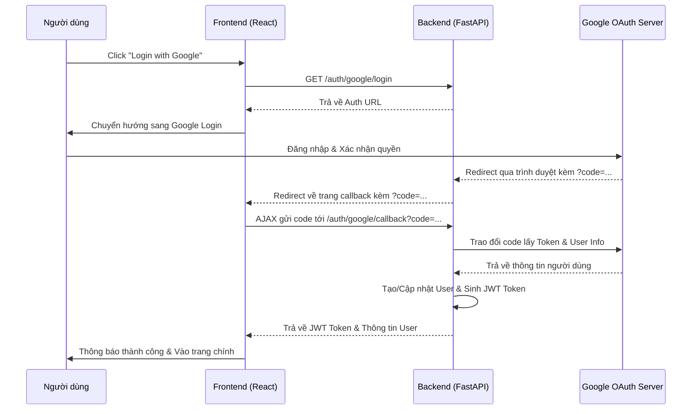

# Hướng dẫn cấu hình Google Login (OAuth 2.0)

Tài liệu này hướng dẫn cách thiết lập Google OAuth 2.0 để tích hợp tính năng đăng nhập bằng Google vào ứng dụng Bloom.

## 1. Tạo dự án trên Google Cloud Console

1. Truy cập [Google Cloud Console](https://console.cloud.google.com/).
2. Đăng nhập bằng tài khoản Google của bạn.
3. Chọn project hiện có hoặc tạo project mới:
   - Click vào menu chọn project ở góc trên bên trái.
   - Nhấn **"New Project"**.
   - Nhập tên project (ví dụ: `Bloom-App`) và nhấn **"Create"**.

## 2. Cấu hình OAuth Consent Screen (Màn hình xác thực)

Trước khi tạo credentials, bạn cần cấu hình màn hình mà người dùng sẽ thấy khi đăng nhập.

1. Vào menu **APIs & Services** > **OAuth consent screen**.
2. Chọn **User Type**:
   - **External**: Nếu bạn muốn bất kỳ ai có tài khoản Google cũng có thể dùng.
   - Nhấn **Create**.
3. Điền các thông tin bắt buộc:
   - **App name**: Bloom (hoặc tên ứng dụng của bạn).
   - **User support email**: Chọn email của bạn.
   - **Developer contact information**: Nhập email của bạn.
4. Nhấn **Save and Continue** cho các bước tiếp theo (Scopes, Test Users).
5. Ở bước cuối, nhấn **Back to Dashboard**.
6. **Lưu ý quan trọng**: Khi ứng dụng đang ở chế độ "Testing", chỉ những email được thêm trong danh sách "Test users" mới có thể đăng nhập. Để cho phép mọi người dùng, bạn cần nhấn **"Publish App"**.

## 3. Tạo OAuth 2.0 Credentials

1. Vào menu **APIs & Services** > **Credentials**.
2. Nhấn **Create Credentials** > **OAuth client ID**.
3. Chọn **Application type**: **Web application**.
4. Nhập tên (ví dụ: `Bloom Web Client`).
5. Cấu hình URIs:
   - **Authorized JavaScript origins**:
     - `http://localhost:5173` (Dành cho môi trường phát triển Vite)
     - `https://yourdomain.com` (Dành cho môi trường production)
   - **Authorized redirect URIs**: Đây là URL mà Google sẽ gửi mã xác thực về backend.
     - `http://localhost:8000/api/v1/auth/google/callback` (Backend local)
     - `https://api.yourdomain.com/api/v1/auth/google/callback` (Backend production)
6. Nhấn **Create**.
7. Một hộp thoại hiện ra chứa **Client ID** và **Client Secret**. Hãy lưu chúng lại.

## 4. Cấu hình biến môi trường (Environment Variables)

### Cho Backend (.env file)

Cập nhật file `.env` ở thư mục gốc của backend (hoặc cấu hình trong Admin Dashboard nếu hệ thống có hỗ trợ):

```env
GOOGLE_CLIENT_ID=vừa_copy_ở_bước_trên.apps.googleusercontent.com
GOOGLE_CLIENT_SECRET=vừa_copy_ở_bước_trên
GOOGLE_REDIRECT_URI=http://localhost:8000/api/v1/auth/google/callback
JWT_SECRET_KEY=một_chuỗi_ký_tự_ngẫu_nhiên_dài_để_bảo_mật
```

### Cho Frontend (.env file)

Nếu frontend cần gọi trực tiếp URL login của Google hoặc cần Client ID:

```env
VITE_GOOGLE_CLIENT_ID=vừa_copy_ở_bước_trên.apps.googleusercontent.com
```

## 5. Kiểm tra luồng đăng nhập

1. Khởi động Backend và Frontend.
2. Truy cập trang đăng nhập.
3. Nhấn nút "Login with Google".
4. Nếu thành công, bạn sẽ được chuyển hướng đến màn hình Google, sau đó quay lại ứng dụng và đã được đăng nhập.

## 6. Các lỗi thường gặp

- **Error: redirect_uri_mismatch**: Kiểm tra xem URL trong `GOOGLE_REDIRECT_URI` của backend có khớp 100% với URL đã cấu hình trong Google Cloud Console hay không.
- **Error: 403 access_denied**: Do ứng dụng đang ở chế độ Testing và email bạn dùng chưa được thêm vào "Test users".
- **Token không hợp lệ**: Đảm bảo `JWT_SECRET_KEY` ở backend khớp với key dùng để giải mã (nếu có bên thứ 3).

## 7. Code Mẫu Thực Tế

### 7.1 Backend (FastAPI)
Backend xử lý việc tạo URL đăng nhập và trao đổi code lấy Token.

```python
# app/routers/auth.py
from fastapi import APIRouter, Depends
from app.config import settings

router = APIRouter()

@router.get("/google/login")
async def google_login():
    params = {
        "client_id": settings.GOOGLE_CLIENT_ID,
        "redirect_uri": settings.GOOGLE_REDIRECT_URI,
        "response_type": "code",
        "scope": "openid email profile",
        "access_type": "offline",
        "prompt": "consent"
    }
    query_string = "&".join([f"{k}={v}" for k, v in params.items()])
    return {"auth_url": f"https://accounts.google.com/o/oauth2/v2/auth?{query_string}"}

@router.get("/google/callback")
async def google_callback(code: str):
    # 1. Trao đổi code lấy access_token từ Google
    # 2. Lấy thông tin user (email, name) từ Google
    # 3. Lưu user vào Database nếu chưa có
    # 4. Tạo JWT token của riêng hệ thống và trả về cho Frontend
    return {"access_token": "JWT_TOKEN_HERE", "user": {...}}
```

### 7.2 Frontend (React/TypeScript)
Frontend gọi API backend để lấy URL và xử lý sau khi Google redirect về.

```typescript
// services/auth.ts
export const authService = {
  getGoogleLoginUrl: async () => {
    const res = await fetch("/api/v1/auth/google/login");
    const data = await res.json();
    window.location.href = data.auth_url; // Chuyển hướng sang Google
  },
  
  handleCallback: async (code: string) => {
    const res = await fetch(`/api/v1/auth/google/callback?code=${code}`);
    return res.json(); // Nhận JWT token và thông tin user
  }
};

// Component xử lý callback (OAuthCallback.tsx)
useEffect(() => {
  const code = new URLSearchParams(window.location.search).get("code");
  if (code) {
    authService.handleCallback(code).then(data => {
      // Lưu token vào localStorage và redirect về trang chủ
      localStorage.setItem("token", data.access_token);
      window.location.href = "/";
    });
  }
}, []);
```

## 8. Luồng hoạt động chi tiết (Flow Sequence)

Hệ thống sử dụng luồng Authorization Code Flow kết hợp giữa Chuyển hướng trình duyệt và AJAX để tối ưu trải nghiệm.

### 8.1 Sơ đồ tuần tự (Sequence Diagram)



### 8.2 Giải thích các bước

1.  **Khởi tạo**: Người dùng nhấn đăng nhập, Frontend không tự tạo URL mà gọi Backend để lấy URL chuẩn (chứa Client ID và Scopes).
2.  **Xác thực tại Google**: Người dùng thao tác trực tiếp với Google, đảm bảo an toàn mật khẩu.
3.  **Hứng Code (Callback Phase 1)**: Google gửi mã `code` về Backend. Tại đây, backend thực hiện một lệnh redirect (302) để đưa người dùng quay trở lại giao diện Frontend (kèm theo mã code trên URL).
4.  **Xác thực với hệ thống (Callback Phase 2)**: Frontend lấy mã `code` từ URL và gọi API callback của Backend bằng AJAX.
5.  **Hoàn tất**: Backend dùng `code` đó để nói chuyện với Google ("Tôi là server của dự án này, hãy cho tôi thông tin của người vừa đăng nhập"). Sau đó Backend tạo phiên làm việc (JWT) gửi về cho Frontend lưu trữ.

---
*Tài liệu này giúp đảm bảo quá trình tích hợp Google Auth diễn ra mượt mà và bảo mật.*
